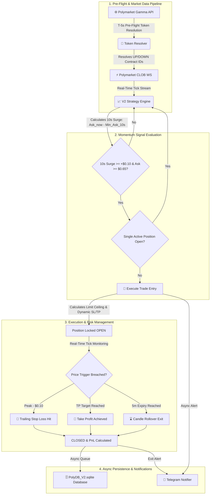

# 🤖 Polymarket BTC-5m Odds Momentum Bot (`BTC_Bot_Momentum`)

👤 **Author**

**Abhay Singh**
- 📧 Email: [abhay.rkvv@gmail.com](mailto:abhay.rkvv@gmail.com)
- 🐙 GitHub: [AbhaySingh989](https://github.com/AbhaySingh989)
- 💼 LinkedIn: [Abhay Singh](https://www.linkedin.com/in/abhay-pratap-singh-905510149/)

__________________________________________________________________

📖 **About**

`BTC_Bot_Momentum` is an automated, high-frequency **Odds Momentum Trading Bot** engineered specifically for **Polymarket** 5-minute Bitcoin Up/Down binary option markets (`btc-updown-5m-{timestamp}`).

The bot connects to Polymarket's Central Limit Order Book (CLOB) WebSocket API to process tick-by-tick orderbook updates in real time. It monitors rapid price shifts over a 10-second sliding lookback window, identifies strong directional momentum surges, and automatically enters risk-managed trades backed by dynamic Take Profit (TP), High Water Mark (HWM) Trailing Stop Loss (SL), single position safety guards, and async SQLite persistence.

---

✨ **Features**

🚀 **Core Functionality**

- **Tick-by-Tick Orderbook Streaming**: Direct WebSocket connection to Polymarket CLOB (`wss://ws-subscriptions-clob.polymarket.com/ws/market`) for zero-latency bid/ask ticks.
- **T-5s Pre-Flight Contract Resolution**: Automatically queries Polymarket Gamma API 5 seconds prior to candle boundaries (T-5s / 295s mark) to resolve outcome token contract IDs with zero gap during 5m candle handoffs.
- **10-Second Odds Surge Detection**: Triggers trade entries when outcome token ask prices surge by $\ge +\$0.10$ within 10 seconds and meet the $\$0.65$ minimum entry floor.
- **Two-Tier Dynamic Take Profit (TP)**:
  - *Tier 1 (Entry < $0.84)*: Target = Fill Price + $\$0.20$ (+20 cents).
  - *Tier 2 (Entry $\ge$ $0.84)*: Target = Fixed payout cap at $\$0.995$.
- **High Water Mark Trailing Stop-Loss**: Dynamically trails the stop-loss price $\$0.10$ below the peak price observed during the position's lifecycle.
- **Single Active Position Guard**: Enforces a strict maximum limit of 1 active position across the bot to eliminate over-exposure.

🛠️ **Configuration & Remote Control**

- **Telegram Remote Controls**: Control the bot, switch execution modes, monitor PnL, and inspect parameters live via Telegram slash commands.
- **Interactive Command Menu**: Registers commands with Telegram's `setMyCommands` API so users can select commands from an interactive UI menu/hamburger button without manual typing.
- **Dry-Run & Live Execution Modes**: Supports paper trading simulation (`DRY_RUN`) as well as real Polygon wallet EIP-712 order execution (`LIVE`).

🔒 **Reliability & Storage**

- **Non-Blocking Async Database Writer**: Queues database writes asynchronously (`AsyncDBWriter`) to guarantee zero event-loop blocking during market updates.
- **Dockerized & Cloud-Ready**: Fully dockerized with `docker-compose.yml` for 24/7 deployment on OCI (Oracle Cloud Infrastructure) or any VPS.

---

📊 **How It Works**

This diagram illustrates the complete workflow of the Polymarket BTC Momentum Bot, from WebSocket ingestion to risk-managed execution and remote notifications.



---

🛠️ **Installation & Setup**

Follow these steps to get your bot up and running locally or on a server.

**Prerequisites**

- [Python 3.11+](https://www.python.org/downloads/)
- [Docker Desktop](https://www.docker.com/products/docker-desktop/) (for containerized deployment)

**Step 1: Clone the Repository**

```bash
git clone https://github.com/AbhaySingh989/BTC_Bot_Momentum.git
cd BTC_Bot_Momentum
```

**Step 2: Install Dependencies (Local Run)**

```bash
# Create a virtual environment
python -m venv venv
source venv/bin/activate  # On Windows: venv\Scripts\activate

# Install required packages
pip install -r requirements.txt
```

**Step 3: Configure Environment Variables**

Create a `.env` file in the root directory by copying the example:

```bash
cp .env.example .env
```

Edit `.env` to configure your settings:

```env
# Execution Mode: DRY_RUN (Simulation) or LIVE
EXECUTION_MODE=DRY_RUN

# Strategy Thresholds
V2_MOMENTUM_THRESHOLD_CENTS=0.10
V2_MOMENTUM_WINDOW_SEC=10.0
V2_ENTRY_SLIPPAGE_BUFFER=0.04
V2_TAKE_PROFIT_CENTS=0.20
V2_HIGH_ODDS_CUTOFF=0.84
V2_HIGH_ODDS_TP_TARGET=0.995
V2_TRAILING_SL_ENABLED=TRUE
V2_TRAILING_SL_DISTANCE_CENTS=0.10
V2_MIN_ENTRY_ODDS_FLOOR=0.65
MAX_POSITION_SIZE_USD=2.0

# Telegram Notifications & Remote Control
TELEGRAM_ENABLED=TRUE
TELEGRAM_BOT_TOKEN=your_bot_token_from_botfather
TELEGRAM_CHAT_ID=your_telegram_chat_id
TELEGRAM_AUTHORIZED_USER_IDS=your_user_id
```

---

🚀 **Usage & Deployment**

### Option A: Running with Docker Compose (Recommended for 24/7 Server Deployment)

1. **Create an empty database placeholder file**:
   ```bash
   touch PolyDB_V2.sqlite  # Windows PowerShell: New-Item -ItemType File PolyDB_V2.sqlite
   ```

2. **Build and launch container in background**:
   ```bash
   docker compose up -d --build
   ```

3. **Monitor Live Logs**:
   ```bash
   docker compose logs -f polymarket-v2
   ```

4. **Updating the Bot**:
   ```bash
   git pull
   docker compose up -d --build
   ```

---

### Option B: Running Standalone via Python

```bash
python main.py
```

---

📱 **Telegram Remote Controls**

Once your bot is running with Telegram configured, open your chat in Telegram to access the interactive `/` **command menu**:

| Command | Description |
| :--- | :--- |
| `/status` | View live system status, active mode, and position counts |
| `/config` | View all active strategy configuration parameters |
| `/pnl` | View lifetime trades, win rate %, and cumulative financial PnL |
| `/activate` | Enable trading signal evaluation |
| `/deactivate` | Pause trading signal evaluation |
| `/dryrun on` | Switch execution mode to `DRY_RUN` (Simulation) |
| `/dryrun off` | Switch execution mode to `LIVE` |
| `/help` | Show interactive control menu |

---

📁 **Project Structure**

```
BTC_Bot_Momentum/
├── 📜 main.py                    # Main orchestrator loop & event triggers
├── 🔧 src/config.py              # Central single source of truth for strategy & settings
├── 📈 src/execution/
│   ├── strategy.py              # V2 Odds Momentum strategy, TP/SL, & position guard
│   ├── risk_engine.py           # Drawdown risk management
│   └── reconciler.py            # State reconciliation
├── 🌐 src/polymarket/
│   ├── token_resolver.py        # T-5s Pre-Flight Gamma API contract ID resolver
│   └── polymarket_ws.py         # Async CLOB WebSocket orderbook client
├── 🗄️ src/database/
│   ├── connection.py            # PolyDBManager & non-blocking AsyncDBWriter
│   └── schema.py                # DDL schema definitions (Positions, Odds_OHCLV, BTC_OHCLV)
├── 📱 src/notifications/
│   ├── notifier.py              # Telegram alert dispatcher (HTML formatting)
│   └── telegram_bot.py          # Telegram slash command router & setMyCommands menu
├── 🐳 Dockerfile                # Lightweight Python 3.11 container definition
├── 🐙 docker-compose.yml        # Docker service definition with volume mounting
├── 📋 requirements.txt           # Project Python dependencies
└── 📝 BTC_1_OCI_bot_commands.txt # Reference guide for OCI server management
```

---

🐛 **Troubleshooting**

- **Telegram `HTTP 404` Error**:
  - Verify that `TELEGRAM_BOT_TOKEN` in `.env` is a valid API token from `@BotFather`.
  - Open a direct chat with your bot in Telegram and click **Start** (`/start`).
- **Database `IsADirectoryError` in Docker**:
  - Ensure you ran `touch PolyDB_V2.sqlite` on the host before running `docker compose up -d`.
- **No Trades Triggering**:
  - Verify that `V2_MOMENTUM_THRESHOLD_CENTS` (e.g. 0.10) and `V2_MIN_ENTRY_ODDS_FLOOR` (e.g. 0.65) conditions are met during high-volatility 5m candle surges.

---

🤝 **Contributing**

Contributions are welcome! If you have suggestions or improvements:

1. Fork the repository (`https://github.com/AbhaySingh989/BTC_Bot_Momentum`).
2. Create your feature branch (`git checkout -b feature/amazing-feature`).
3. Commit your changes (`git commit -m 'Add amazing feature'`).
4. Push to the branch (`git push origin feature/amazing-feature`).
5. Open a Pull Request.

---

Made with ❤️ by [Abhay Singh](https://github.com/AbhaySingh989)
